# 05 — Strategy payoffs

The structures the playbook scores and recommends, each with its expiry-payoff diagram.

**How to read these.** The horizontal axis is the underlying price at expiry; the vertical
axis is profit/loss per one unit of underlying. Green is profit, red is loss, the bold grey
line is zero, and the open circles are breakevens. The strikes are marked on the price axis.
All shapes are **illustrative and gross of fees** with representative BTC-scale strikes and
premiums — not live quotes. The real system computes exact breakevens and max profit/loss
from the live chain and applies the fee model on top; see [01 — Design §3.10](01-design.md)
for the payoff engine and §3.1 for fees.

A single rule organizes the whole library: **defined-risk structures are structurally
favored in scoring**, and any structure with a naked tail is flagged as such. Read every
diagram tail-first — *where does the loss stop?*

---

## Neutral premium-selling (the core income structures)

### Cash-secured put
Sell an out-of-the-money put; keep the full credit while spot holds above the strike. The
downside is the naked put tail (bounded only at zero). Picked in neutral-to-bullish, high-VRP
regimes.

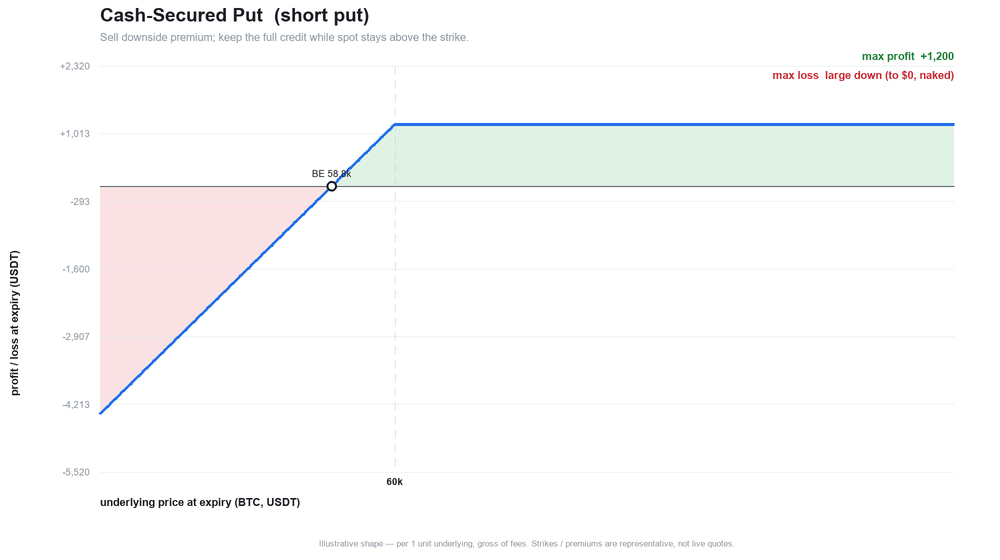

### Covered call
Own the underlying and sell an upside call for yield; the call caps the upside above its
strike while you keep full downside participation. Picked when holding the underlying in a
neutral-to-mildly-bullish regime.

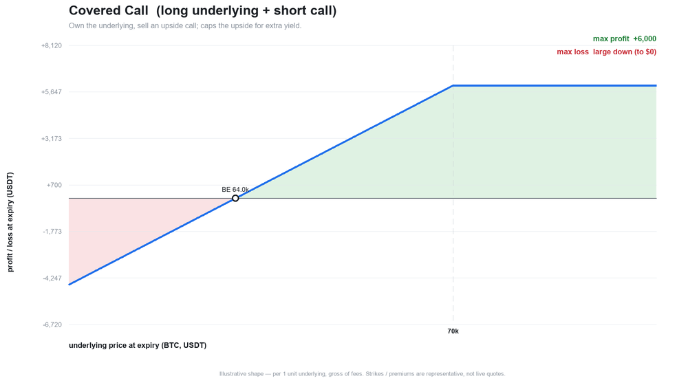

### Short strangle (naked)
Sell an OTM put and an OTM call for maximum premium. The profit is capped at the credit
between the strikes; **both tails are uncapped**. This is the reference book's core posture —
and exactly why the executable-close and Capture% tooling exists (a growing tail must never
hide behind an optimistic mark). Picked in high-VRP, range-bound regimes; carries a
structural scoring penalty for its naked tails.

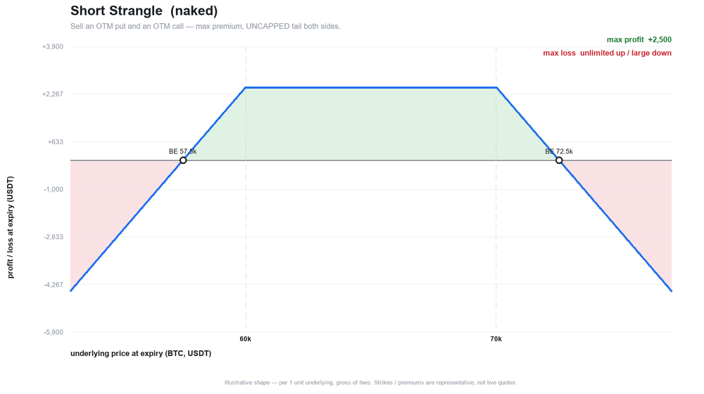

### Iron condor
A short strangle with both wings bought back — the same range-bound thesis with **defined
risk**. Lower max profit than the strangle, but the tails are capped. Favored over the
strangle at equal signal edge.

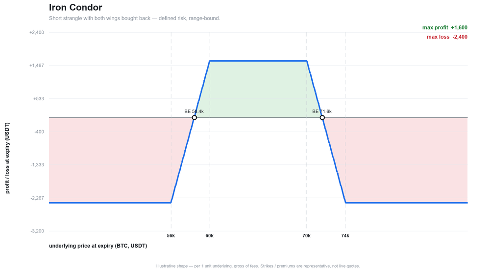

### Iron butterfly
Sell the at-the-money straddle and buy protective wings — maximum theta, a tight pin play
around the current price. Defined risk. Picked when expected move is rich and the tape is
pinned.

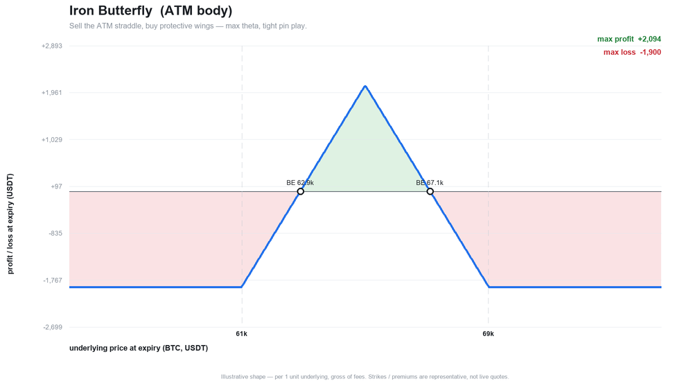

---

## Defined-risk directional

### Bull put credit spread
A short put financed by a lower long put — a bullish-to-neutral credit trade with a hard
floor on the loss. One of the "finally reachable" defined-risk credit structures. Picked when
the trend filter leans up and VRP supports selling.

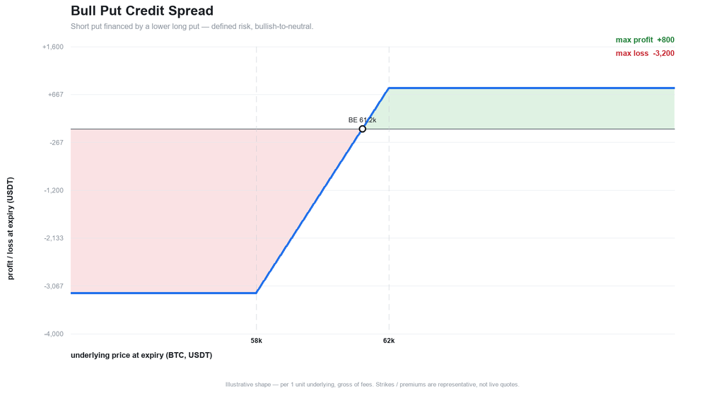

### Bear call credit spread
The mirror: a short call capped by a higher long call, bearish-to-neutral, defined risk.
Picked when the trend leans down and call premium is worth selling.

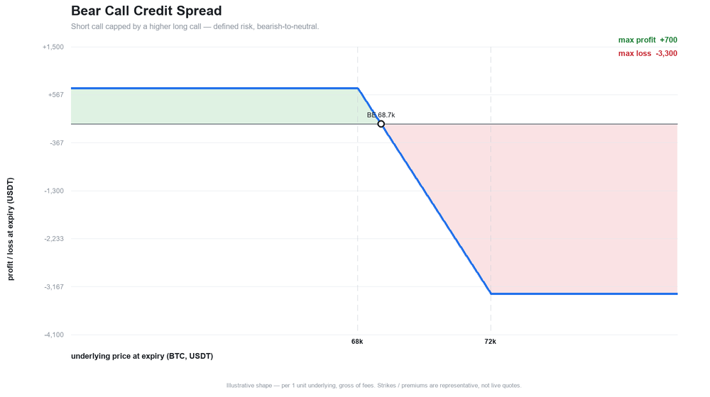

---

## Skew and tail harvesters

### Jade lizard
A short put plus a short call spread, sized so the **total credit is at least the call-spread
width** — which removes upside risk entirely (the payoff stays positive no matter how far the
underlying rallies). Only the downside put tail remains. Picked to harvest call-side premium
without taking upside risk in a put-rich regime.

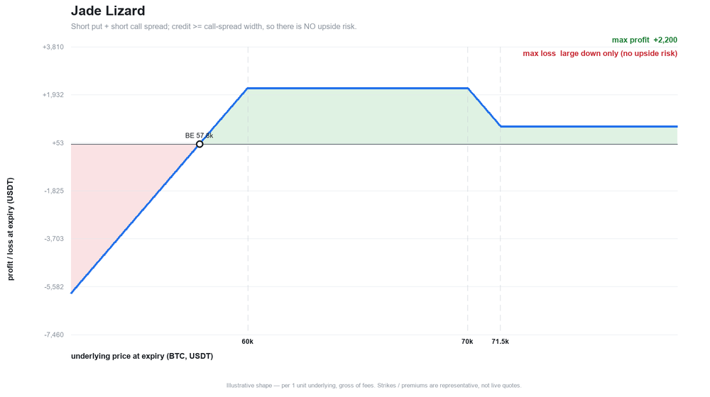

### Broken-wing butterfly (put fly for a credit)
A 1-2-1 put butterfly with a wider lower wing, entered for a credit. Defined risk, no upside
risk, and it monetizes put skew — the peak sits where the body strikes are. Picked to harvest
put skew with a bounded, credit-financed structure.

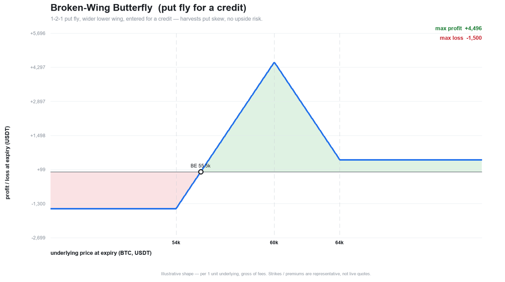

### Put ratio spread
A long put over two short lower puts, entered for a credit. Profits in a mild drift down to
the short strikes, but the extra short put leaves **undefined risk below the lower
breakeven** — flagged accordingly. Picked for a measured-pullback thesis in a put-skew-rich
regime.

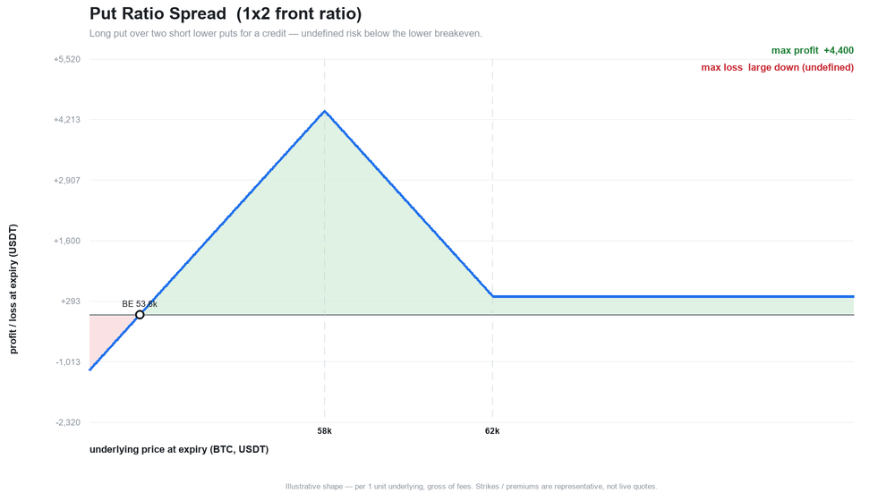

### Risk reversal
Sell a rich OTM put to finance a long OTM call — a synthetic-long shape entered at or near
zero cost, monetizing put skew. Uncapped upside, naked put downside. Gated hard against a
downtrend and only emitted when skew is genuinely extreme.

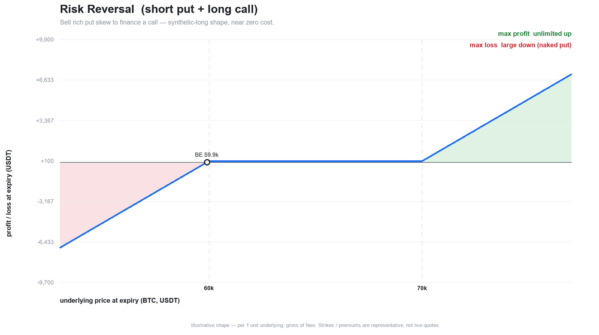

---

## Defensive structures

### Put ladder
A short put plus **two** lower long puts, entered for a credit. There is a defined pocket of
loss between the strikes — but far enough down, a **crash turns the position profitable**.
The put structure *for* nervous tape; its downtrend scoring penalty is deliberately mild.

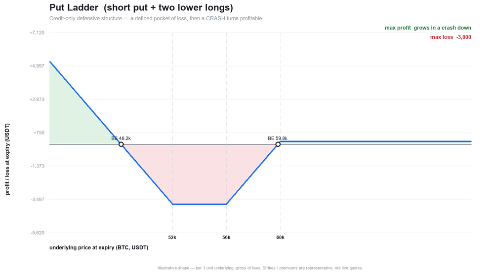

### Seagull
A short put funds a long call spread — cheap (zero-cost or credit) bullish participation with
a capped upside and a downside put tail. Picked for financed directional exposure when skew
lets the put pay for the calls.

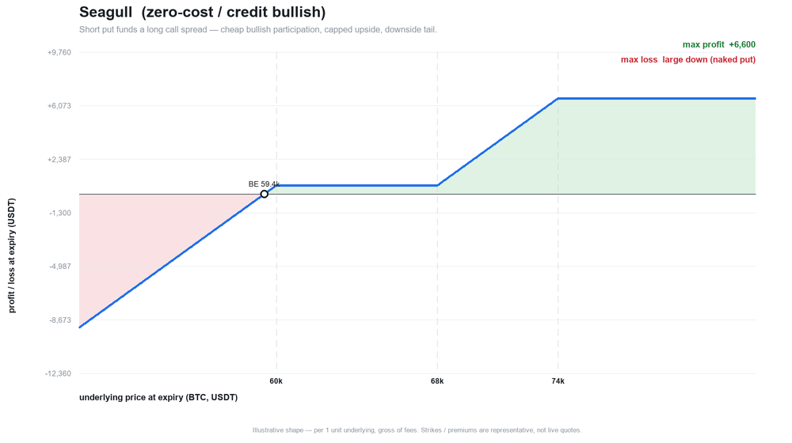

---

## Long volatility

### Calendar
Long a far-dated option and short a near-dated one at the same strike — the library's only
**long-vega, debit** structure. It profits if the underlying sits near the strike into the
front expiry and benefits from cheap vol and contango, so its scoring **inverts** the VRP /
IV-rank / term-structure components: **low-IV regimes surface a calendar instead of "Wait."**
(Shown here as value at the front expiry; it is cross-expiry, so it is excluded from the
piecewise-linear payoff engine.)

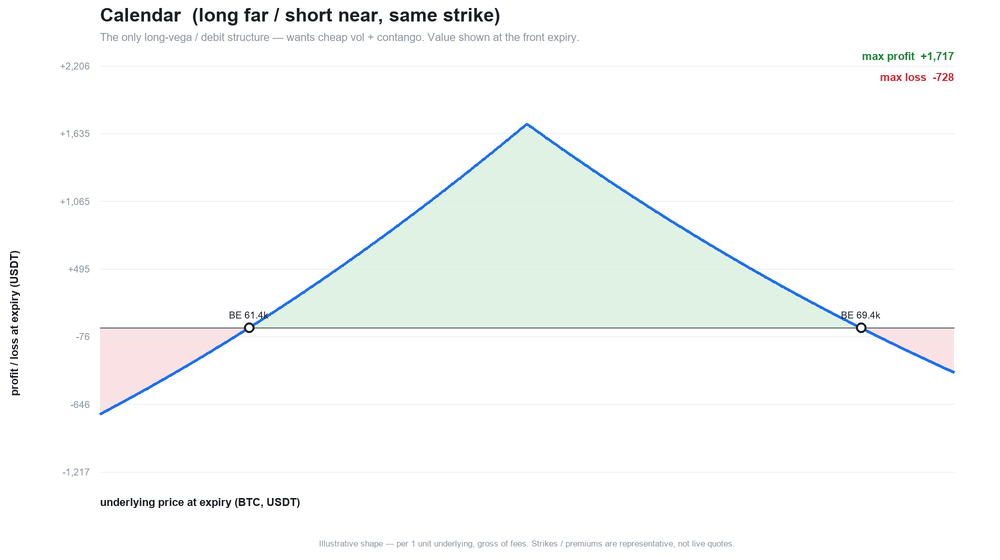
